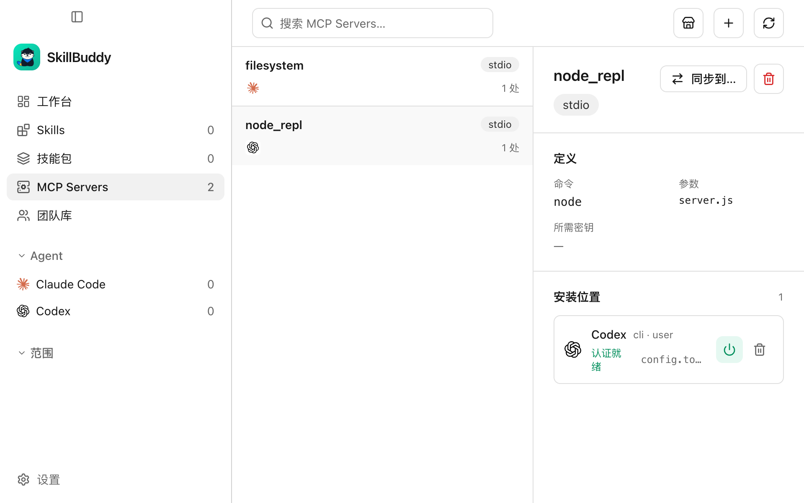
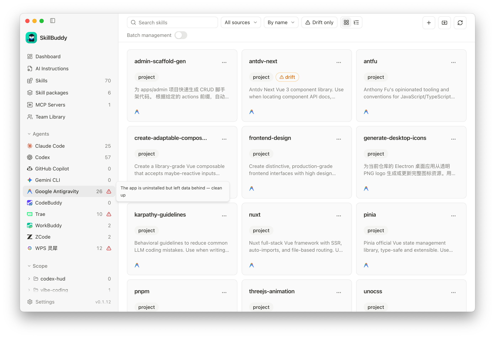
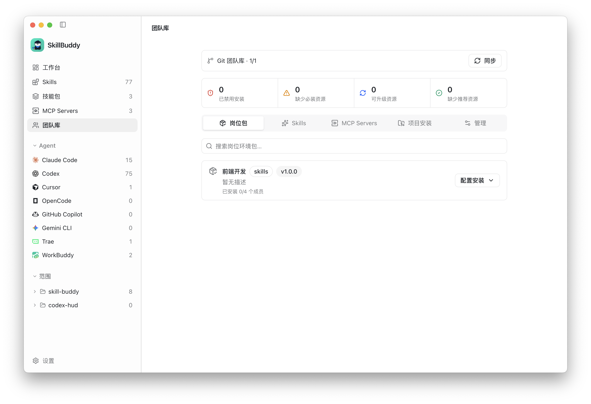
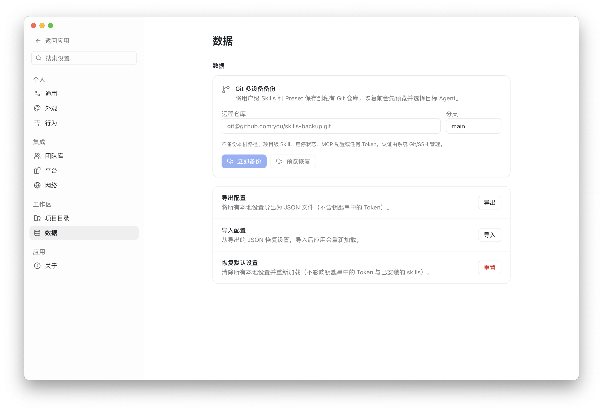
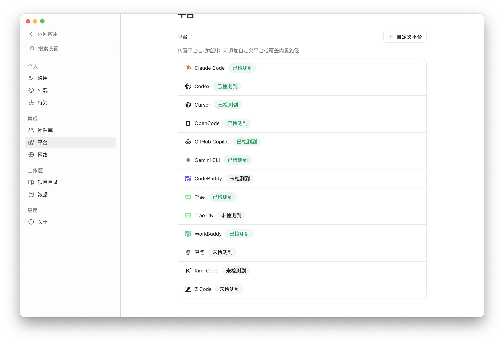

<p align="center">
  
</p>

<h1 align="center">SkillBuddy</h1>

<p align="center">
  跨 AI Agent 管理、安装、同步 Skills、MCP Servers 与 AI 指令文件的桌面工作台。
</p>

<p align="center">
  <a href="README.md">English</a> · 简体中文
</p>

<p align="center">
  
  
  
</p>

SkillBuddy 将不同 AI 编程工具分散在各自目录中的 Skills、MCP 配置和 AI 指令文件聚合到一个界面中。你可以查看本机安装状态、跨平台分发内容、处理多端漂移和规则文件冲突、对比各工具实际读取的内容、从市场发现资源，并通过 Git 团队库管理经过审核的团队资产。

## 界面预览

以下均为完整窗口截图，用于展示 SkillBuddy 的主要工作流和界面结构。Skills 页面支持列表视图和平铺网格视图两种浏览方式。

<div align="center">
  
  <br />
  <sub>工作台：查看本机资产、检测到的 Agent、内容漂移和市场发现入口。</sub>
</div>

<div align="center">
  
  <br />
  <sub>MCP Servers：查看定义、传输方式、安装目标和运行状态。</sub>
</div>

<div align="center">
  
  <br />
  <sub>Skills 清单：按 Agent、全局目录、项目目录、插件和系统资源浏览技能。</sub>
</div>

<div align="center">
  
  <br />
  <sub>Skills 平铺视图：以网格卡片快速浏览技能名称、来源和摘要。</sub>
</div>

<div align="center">
  
  <br />
  <sub>团队库：同步 Git 管理的资源，查看策略状态并配置岗位包。</sub>
</div>

<div align="center">
  
  <br />
  <sub>项目 Skills：查看项目本地资源，并比较不同 Agent 的安装情况。</sub>
</div>

<div align="center">
  
  <br />
  <sub>数据：将用户级 Skills 和 Preset 备份到 Git，导出设置或恢复历史配置。</sub>
</div>

<div align="center">
  
  <br />
  <sub>平台：查看已检测的 Agent 集成，并添加自定义平台路径。</sub>
</div>

## 核心能力

- **统一资产视图**：自动发现并聚合不同 Agent 中的 Skills、MCP Servers 和 AI 指令文件。
- **跨平台安装**：将同一个 Skill 安装到多个用户级或项目级目标。
- **漂移检测与同步**：发现同名 Skill 在不同平台上的内容差异，选择基准版本后同步。
- **启用、禁用和卸载**：在可管理目录中调整 Skill 状态，删除操作支持移入废纸篓和撤销。
- **Skills 市场**：搜索 skills.sh、SkillHub 和 GitHub，查看内容与资源后安装。
- **MCP 市场与配置计划**：发现 MCP Server，检查目标平台能力，在写入前预览具体变更。
- **AI 指令管理**：发现全局和项目作用域中的 `AGENTS.md`、`CLAUDE.md`、`GEMINI.md` 及各工具规则文件，在预览变更后新建、编辑或删除。
- **指令生效链**：查看某个目录下各工具实际读取的文件顺序，以及哪些文件被遮蔽或需要额外配置才会生效。
- **指令诊断与桥接**：检测失效链接、内容漂移、重复文件和无效 `@path` 导入，并为只维护 `AGENTS.md` 的项目创建 Claude Code 桥接。
- **Preset 与技能包**：保存常用 Skill 组合，批量安装、启停或导入导出。
- **Git 多设备备份**：将用户级 Skills、Preset 和全局指令文件保存到私有 Git 仓库，并在其他设备预览恢复。
- **Git 团队库**：通过受保护分支和 PR/MR 管理经过审核的团队 Skills、MCP、指令模板、岗位包和策略。
- **项目合规**：使用 `.skillbuddy/team.yaml` 声明项目依赖，检查缺失、过期、禁用和无效引用。
- **自定义平台**：配置额外 Agent 的检测路径、用户目录和项目目录。
- **中英文界面**：内置简体中文和英文。

## 支持平台

SkillBuddy 内置以下 Skills 目录约定：

| Agent | 用户级 | 项目级 |
| --- | :---: | :---: |
| Claude Code | ✓ | ✓ |
| Codex | ✓ | ✓ |
| Cursor | ✓ | ✓ |
| OpenCode | ✓ | ✓ |
| Pi | ✓ | ✓ |
| OMP Agent | ✓ | ✓ |
| GitHub Copilot | ✓ | ✓ |
| Gemini CLI | ✓ | ✓ |
| Google Antigravity | ✓ | ✓ |
| Qwen Code | ✓ | ✓ |
| CodeBuddy | ✓ | ✓ |
| Trae / Trae CN | ✓ | ✓ |
| WorkBuddy | ✓ | - |
| 豆包 | ✓ | - |
| Kimi Code | ✓ | ✓ |
| ZCode | ✓ | ✓ |
| WPS 灵犀 | ✓ | - |

不同平台的 MCP 配置格式、作用域和能力并不完全一致。SkillBuddy 会在界面中展示实际检测到的入口和能力，并在应用变更前进行校验。部分平台约定仍需要更多真机反馈，详见 [平台约定说明](docs/platform-conventions.md)。

## AI 指令

**AI 指令**页面用于管理 AI 工具在会话开始时读取的项目规则与上下文文件 —— 也就是平时散落在 `AGENTS.md`、`CLAUDE.md`、`GEMINI.md`、`CODEBUDDY.md` 和各工具规则目录中的那些文件。

- **两种作用域**：用户主目录下的全局指令文件，以及已登记项目内部的指令文件。
- **分工具建模**：每个工具的入口文件名、同目录优先级、本地覆盖文件（`AGENTS.local.md`、`CODEBUDDY.local.md`）、override 文件（`AGENTS.override.md`）、规则目录和回退文件都单独登记。首期覆盖 Codex、Cursor、Claude Code、DeepSeek Harness、OpenCode、Pi Coding Agent、CodeBuddy Code、Google Antigravity、Gemini CLI、ZCode、Grok Build 和 WorkBuddy。
- **生效链**：指定工具和目录后，可以看到真正生效的文件顺序 —— 先全局文件，再从仓库根逐级向下到该目录 —— 并标注哪些是回退来源、被更高优先级文件遮蔽，或需要额外配置后才会生效。
- **诊断**：失效或越出项目的链接、`AGENTS.md` 与 `CLAUDE.md` 的内容漂移、内容重复的文件、无法解析的 `@path` 导入，都会按严重级别列出，可自动修复的会单独标记。
- **跨工具桥接**：项目只维护 `AGENTS.md` 时，可以创建 Claude Code 桥接文件来导入它；已经带有独立规则的 `CLAUDE.md` 不会被覆盖。
- **先审后写**：新建、编辑、删除和桥接都会先生成变更计划，列出受影响的文件和工具，应用后可以撤销。

工具规则会记录证据等级：仅有社区证据或尚未验证的规则会以警告形式呈现，不会被当作已确认的生效链；其它等级会在生效链旁标注。

## 系统支持

SkillBuddy 桌面端当前提供以下构建目标：

| 操作系统 | 处理器架构 | 最低版本 | 支持状态 |
| --- | --- | --- | --- |
| macOS | Apple Silicon（`arm64`） | macOS 11 Big Sur | 正式支持，DMG 和 ZIP |
| macOS | Intel（`x64`） | macOS 11 Big Sur | 正式支持，DMG 和 ZIP |
| Windows | `x64` | Windows 10 及以上 | 正式支持，NSIS 安装包和 ZIP |
| Windows | `arm64` | Windows 11 | 预览构建，NSIS 安装包和 ZIP，待 ARM64 真机验证 |
| Linux | `x64` | 现代桌面发行版 | 正式支持，AppImage、DEB 和 RPM |
| Linux | `arm64` | 现代桌面发行版 | 预览构建，AppImage、DEB 和 RPM，待 ARM64 真机验证 |

发布文件统一采用 `SkillBuddy-v<版本>-<系统>-<架构>.<扩展名>` 命名。

- macOS arm64/x64：`SkillBuddy-v<版本>-macos-<架构>.dmg` 和 `.zip`
- Windows x64/arm64：`SkillBuddy-v<版本>-windows-<架构>.exe` 和 `.zip`
- Linux x64/arm64：`SkillBuddy-v<版本>-linux-<架构>.AppImage`、`.deb` 和 `.rpm`（x64 构建使用 `x86_64`）

## 下载与运行

各系统安装包下载地址：

- [前往 GitHub Releases](https://github.com/konnga/skill-buddy/releases)
- [查看更新日志](CHANGELOG.md)

### macOS 首次启动

由于项目没有使用 Apple Developer ID 签名和公证，macOS 安装包使用完整的临时签名。Gatekeeper 可能因为无法识别开发者而阻止打开。将应用拖入“应用程序”后先打开一次，然后前往“系统设置 → 隐私与安全性 → 安全性”，点击“仍要打开”，确认后即可启动 SkillBuddy。也可以按住 Control 键点击应用并选择“打开”。如果系统中没有出现授权按钮，再确认安装包来自官方 GitHub Release 后使用下面的兜底命令：

```bash
xattr -dr com.apple.quarantine /Applications/SkillBuddy.app
open /Applications/SkillBuddy.app
```

`xattr` 命令只会移除下载隔离属性，应作为最后的兜底方式。如果 macOS 明确提示应用“已损坏”，不要直接绕过提示，应重新下载安装包，因为这通常表示应用签名无效或不完整。

Registry 自托管服务和 CLI 是独立的可选组件，不包含在桌面端安装包中。

SkillBuddy 会读取各 Agent 已有的本地目录。安装、同步、启停或删除等写操作只会作用于界面中明确选择的目标。

## 团队使用

团队可以使用 Git 仓库作为内容、版本、权限和审计的事实来源：

- 维护者在隔离的 `skillbuddy/<标识>` 分支中编辑 Skills、MCP、岗位包和策略。
- 指令模板与 Skills、MCP 定义一起纳入版本管理，可以应用到已登记项目；项目合规会检查指令内容缺失或过期。
- `.skillbuddy/team.yaml` 中声明的指令要求也可以在 CI 中校验：`skm instructions check --project <项目根> --library <团队库检出目录>` 会把项目与本地团队库检出结果比对，必装模板缺失或过期时返回非零退出码。仓库内提供了可直接复制的 PR 工作流 `.github/workflows/instructions-check.yml`。
- 发布前可以审阅文件列表、校验结果和 Git diff。
- GitHub 使用 `gh` 创建 Pull Request，GitLab 使用 `glab` 创建 Merge Request。
- 普通成员只能浏览和安装团队库中已经合并的内容。
- 私有仓库认证交给系统 Git、SSH Agent 或凭据管理器，SkillBuddy 不保存仓库密码。

完整格式与工作流见 [Git 团队库文档](docs/team-library.md)。

## 安全与隐私

- SkillBuddy 默认在本地扫描和管理文件，不要求登录 SkillBuddy 账号。
- GitHub Token 仅用于提升市场 API 限额，并存储在系统安全存储中。
- MCP 定义不允许包含明文 Token、密码或 API Key，敏感值应使用环境变量或密钥引用。
- Git 备份不包含 MCP 配置、Token、本机绝对路径、项目级 Skill 或启停状态；指令备份只包含全局、可写且非链接的文件。
- 系统、管理员和插件拥有的只读 Skill 不会被编辑或删除。
- 指令文件限制在 1 MiB 以内的 UTF-8 内容；写入前会校验文件是否已被其他程序改动，不会静默覆盖。
- 链接型指令文件需要通过其源文件编辑，删除链接只会移除链接本身。
- 主进程会校验可访问路径，拒绝越过受管目录的写入和符号链接逃逸。

## 项目结构

```text
skill-buddy/
├── apps/
│   ├── desktop/       # Electron + Vue 3 桌面应用
│   └── registry/      # 可选的 Fastify + SQLite 自托管 Registry
├── packages/
│   ├── core/          # 统一数据模型、扫描、聚合、适配器、指令规则与安全校验
│   └── cli/           # skm 命令行工具
└── docs/              # 设计、平台约定、Registry 与团队库文档
```

桌面端团队协作默认使用 Git 团队库，不依赖 Registry。Registry 和 CLI 作为可选的自托管与自动化组件保留在 monorepo 中。

## 本地开发

要求：

- Node.js 22 或更高版本
- pnpm 10 或更高版本
- Git

```bash
pnpm install
pnpm dev
```

常用命令：

```bash
pnpm build       # 构建所有 workspace 包
pnpm test        # 运行单元测试
pnpm test:e2e    # 构建并运行 Electron 端到端测试
pnpm typecheck   # 执行全仓库类型检查
```

## 贡献

Issue 和 Pull Request 都欢迎。提交前请尽量：

1. 说明受影响的平台、作用域和复现步骤。
2. 对共享逻辑补充相应测试。
3. 运行与修改范围相关的类型检查或测试。
4. 避免提交真实 Token、本机路径或团队私有内容。

## 开源协议

SkillBuddy 使用 [MIT License](LICENSE) 开源。
